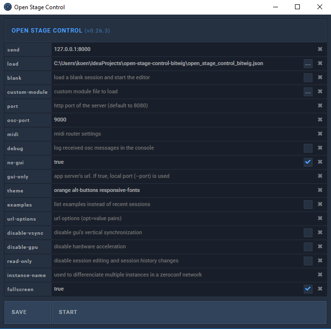

# Open Stage Control template for Bitwig
You can use any device that has google chrome, to remotely control Bitwig studio.
I tried to make it responsive so it should look nice on tablet and phone.

## Dependencies to install
- [DrivenByMoss](https://github.com/git-moss/DrivenByMoss/): an advanced Bitwig extension that communicates with the Bitwig JAVA api to send and receive [OSC](http://opensoundcontrol.org/) commands
- [Open Stage Control](https://github.com/jean-emmanuel/open-stage-control/): a cross platform webapplication that uses OSC language it's own widgets
- you also need a virtual midi channel, I used a program called loopMIDI

## Configuration Bitwig


## Start Open Stage Control from installed executable
This is the most simple way to start Open Stage Control:
- Open the executable, a popup window appears
- Fill in the settings.
- Press SAVE to save the settings for next time.
- Press START and navigate to
    - http://localhost:8080 (from the same device)
    - http://your_ip_adres:8080 (from another android/ipad/etc device connected on the same network)



## Start Open Stage Control headless
Headless mode means, starting the program with the command line.
It won't produce the settings popup and another big advantage is that it will consume a lot less CPU, which is important when you're probably running Bitwig at the same machine.

To do this, simply make a file on your desktop that executes Open Stage Control with the appropriate settings.
For example this is the contents of my open_stage_control.bat file:
```
"C:\Program Files\open-stage-control-win32-x64\open-stage-control.exe" --send 127.0.0.1:8000 --osc-port 9000 --theme orange alt-buttons responsive-fonts --load C:\\Users\\koen\\IdeaProjects\\open-stage-control-bitwig\\open_stage_control_bitwig.json --no-gui --fullscreen```