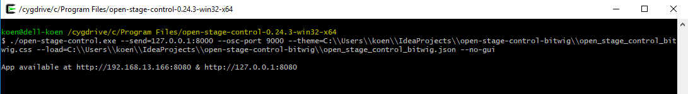
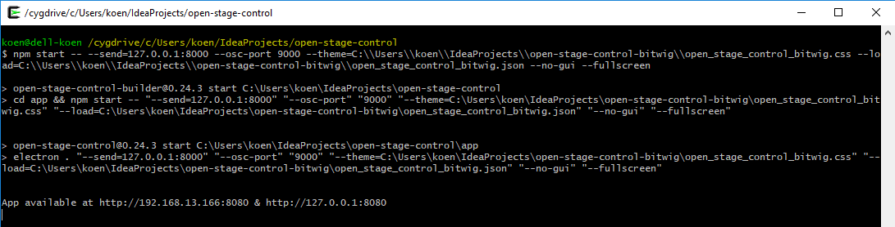

# -----work in progress-----

# Open Stage Control template for Bitwig
With these files, you can use any device that has google chrome, to remotely control Bitwig studio. 
I use it on my android nexus 9 tablet and my little json template is optimized for this resolution.

## Dependencies to install
- [DrivenByMoss](https://github.com/git-moss/DrivenByMoss/): a Bitwig extension that exposes the Bitwig JAVA api to [OSC](http://opensoundcontrol.org/) commands
- [Open Stage Control](https://github.com/jean-emmanuel/open-stage-control/): a cross platform webapplication that uses OSC language it's own widgets

## Configuration Bitwig

## Start Open Stage Control from installed executable
This is the most simple way to start Open Stage Control:
- Open the executable, a popup window appears
- Fill in the settings.
- Press SAVE to save the settings for next time.
- Press START and navigate to
    - http://localhost:8080 (from the same device)
    - http://your_ip_adres:8080 (from another android/ipad/etc device connected on the same network)

## Start Open Stage Control headless
Headless mode means, starting the program with the command line.
It won't produce the settings popup and another big advantage is that it will consume a lot less CPU, which is important when you're probably running Bitwig at the same machine.

### From binary

### From source
